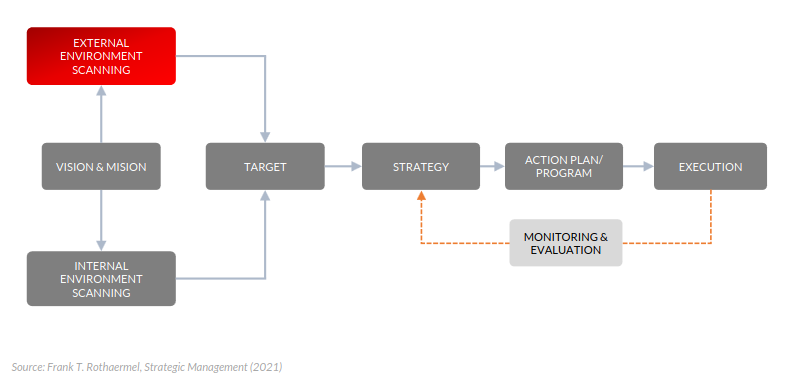

# Economic for Bankers

Istilah-istilah dalam perbankan yang sering digunakan:

Pembicara: Imannudin

| Istilah       | Penjelasan                                                                                                      |
| ------------- | --------------------------------------------------------------------------------------------------------------- |
| Giro          | Simpanan yang penarikannya dapat dilakukan dengan cek atau surat perintah pembayaran lainnya.                   |
| Deposito      | Simpanan yang penarikannya hanya dapat dilakukan setelah jangka waktu tertentu.                                 |
| DPK           | Dana Pihak Ketiga. Merupakan dana yang ditempatkan oleh nasabah pada bank.                                      |
| KBMI          | Kelompok Bank Berdasarkan Modal Inti. Kelompok bank yang dibedakan berdasarkan modal inti.                      |
| Ekonomi Makro | Studi tentang perilaku ekonomi secara keseluruhan.                                                              |
| Ekonomi Mikro | Studi tentang perilaku ekonomi secara individu.                                                                 |
| Motif Ekonomi | Alasan seseorang melakukan sesuatu.                                                                             |
| DSIP          | Domestic Systemic Important Bank. Bank yang memiliki peran penting dalam sistem perbankan nasional.             |
| RBB           | Rencana Bisnis Bank. Merupakan rencana yang dibuat oleh bank untuk mencapai tujuan bisnisnya selama satu tahun. |

Perbedaan deposito dan giros:

1. Deposito:
   - Penarikan hanya dapat dilakukan setelah jangka waktu tertentu.
   - Bunganya lebih tinggi dibandingkan giro.

2. Giro:
   - Penarikan dapat dilakukan setiap saat.
   - Bunganya lebih rendah dibandingkan deposito.

Motif ekonomi syariah:

1. Motif ekonomi syariah:
   - Mencari keuntungan.
   - Mencari keadilan.
   - Mencari kesejahteraan.

Bank merupakan salah satu institusi dan lembaga.

DNA banker:

- Trust and trusted (amanah).
- Create business.

Nasabah BSI: 20 juta.

Valas ada exposure dengan risiko international. Akan menimbulkan komplesitas yang harus di manage dengan baik.

Perbankan merupakan lembaga intermediasi yang menghubungkan antara pihak yang memiliki kelebihan dana dengan pihak yang membutuhkan dana.

- menghimpun dana dari masyarakat
- menyalurkan dana kepada masyarakat
- tidak boleh spekulatif (contoh: investasi saham)

Pajak itu sifatnya disincentive. Pajak itu mengurangi keuntungan.

Peran Chief Economist:

- Financial market paling cepat berubah (bereaksi). Indeks harga saham, nilai tukar, suku bunga.

## Basic Economics

### Permintaaan dan Penawaran

#### Permintaan (Demand)

#### Penawaran (Supply)

Faktor produksi:

- Modal
- Tenaga kerja

#### Equilibrium

Titik keseimbangan antara permintaan dan penawaran. Tetapi kenyataannya tidak selalu ada keseimbangan.

Operasi moneter: mengatur jumlah uang beredar. Bank central menaikan suku bunga untuk mengurangi jumlah uang beredar.

### Money Market

Kategori spekulasi, bank syariah tidak masuk

M2: uang dari investor asing + M1

Uang beredar dipengaruhi oleh suku bunga.

Jumlah uang tidak boleh lebih dari 2x dari target inflasi.

Keungan islam tentang uang:

- transaksi jual beli harus ada barangnya terlebih dahulu
- uang tidak mempunyai nilai waktunya, tetapi pada nilai saat ini

### Otoritas Keuangan

OJK: Otoritas Jasa Keuangan berfungsi mengatur dan mengawasi perbankan. Mengatur yang terkait lembaga keuangan.

BI: Bank Indonesia, mengatur kebijakan moneter. Mengendalikan jumlah uang beredar. GWM (Giro Wajib Minimum) untuk mengendalikan jumlah uang beredar.

Kementrian Keuangan: mengatur kebijakan fiskal. Pajak, APBN, APBD.

LPS: Lembaga Penjamin Simpanan, menjamin simpanan nasabah.

## Macro Economics

Sistem finansial selalu terhubung dengan ekonomi makro dikarenakan kita menjadi intermediasi yang berada ditengah.

Sektor riil:

- Konsumsi rumah tangga
- Investasi swasta

Sektor government:

- Belanja pemerintah
- Subsidi
- Gaji pegawai

Sektor external:

- Export import

GDP: besarnya nilai barang dan jasa yang dihasilkan dalam suatu negara dalam satu tahun.

GDP Nominal: nilai barang dan jasa dalam satu tahun tanpa menghitung inflasi.

GDP Real: nilai barang dan jasa dalam satu tahun dengan menghitung inflasi.

## Monetary and Fiscal Policy

Monetary policy: kebijakan yang dilakukan oleh bank sentral untuk mengendalikan jumlah uang beredar.

Fiscal policy: kebijakan yang dilakukan oleh pemerintah untuk mengendalikan APBN dan APBD.

Moneter dan fiskal sebagai rem dan gas.

## Bank stategic framework

# Industry Analysis

Harus dianalis untuk management resiko supaya tidak ada pembiayaan bermasalah.

Jika sudah masuk APBN pemerintah harus melakukan penganggaran.

## Group Assignment

1. Buat analisis ekonomi prospek bisnis di sektor tersebut
2. Identifikasi dan buat analisis ekonomi yang mempengaruhi

## Industri Otomotif

### Struktur industri & kompetisi

- Pemain besar: Toyota, Honda, Suzuki, Daihatsu
- Pemain lokal: Astra, Indomobil
- Pemain baru: Wuling, DFSK, BYD
- Pemain premium: BMW, Mercedes, Audi
- Pemain motor: Yamaha, Honda, Suzuki
- Pemain motor premium: Harley Davidson, Ducati
- Pemain motor lokal: Astra, Indomobil
- Pemain motor baru: Benelli, KTM
- Pemain motor listrik: Tesla, BYD, Nissan
- Pemain motor listrik lokal: Gesits, Viar
- Pemain motor listrik baru: Niu, Gogoro
- Pemain motor listrik premium: Zero, Energica

