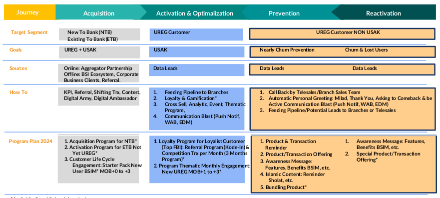

Switching di Indonesia:

- ATM Bersama: PT Artajasa Pembayaran Elektronis
- ATM Prima: PT Bimasakti Multi Sinergi
- ATM Link: PT Rintis Sejahtera
- ATM Alto: PT Daya Network Lestari
- JPN: PT Jalin Pembayaran Nusantara

BSI punya 10 region dan 45 area dengan jumlah cabang 1100-an.

SuperApps (BYOND) diinisiasi oleh Digital Strategy and Product.

Tagline mobile banking: sahabat finansial, spritual, dan sosial.

## Digital Activation Structure

Digital Bussiness Partnership:

- SIZWAF (Sistem Informasi Zakat, Wakaf, dan Amil Zakat Fitrah)

Merchant Aquisition:

- Terdapat dua merchant: EDC dan QRIS

Remittance Business:

- Remittance Business adalah bisnis pengiriman uang ke luar negeri (Transfer Valas, Western Union, dan MoneyGram)

Digital Aquisition:

- Fokus pada akuisisi nasabah baru. Meningkatkan UREG (User Registration) dan USAK (User Activation).

## 5 Fokus Strategi 2024

1. Pertumbuhan Bisnis, Sehat & Sustain
2. Optimalisasi Liquidity Management
3. Transaction Banking
4. Penetrasi Islamic Ecosystem
5. Peningkatan Efisiensi & Produktifitas

## Customer Life Cycle

Jenis-jenis program yang ada di BSI:

1. Diskon
2. Cashback
3. Undian
4. Loyalty Point
5. Racing
6. Direct Gift

## Produk Digital Financing

BSI Oto Online

- BSI sebagai pemodal, MUF adalah collection agent, dan BSI sebagai penjual.

## Lesson learn

why lion is the king of the jungle?

- His mentality