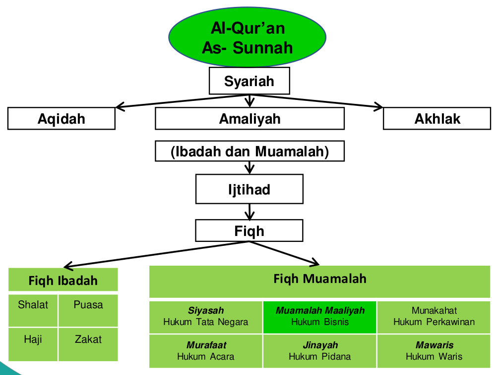

## Kedudukan Fiqih Muamalah

Syariah terbagi menjadi tiga bagian, yaitu: aqidah, amaliah, dan akhlaq. Fiqih muamalah termasuk dalam bagian amaliah. Fiqih muamalah adalah cabang ilmu fiqih yang membahas hukum-hukum yang berkaitan dengan kehidupan bermasyarakat. Fiqih muamalah setidaknya dapat dibagi lagi menjadi berikut:

- Siyasah: hukum-hukum yang berkaitan dengan pemerintahan.
- Muamalah Maaliyah: hukum-hukum yang berkaitan dengan bisnis.
- Munakahat: hukum-hukum yang berkaitan dengan pernikahan.
- Murafaat: hukum-hukum yang berkaitan dengan acara.
- Jinayah: hukum-hukum yang berkaitan dengan pidana.
- Muwaris: hukum-hukum yang berkaitan dengan warisan.

## Sumber Hukum Fiqih Muamalah Maaliyah

Terdapat ragam Ijtihad (pendapat) dalam fiqih muamalah maaliyah. Ragam ijtihad tersebut sebagai berikut:

- **Ijtihad Al-Bayani**: untuk menjelaskan hukum-hukum syara' yang terkandung dalam nash, namun sifatnya masih *zhonni* (bersifat dugaan) baik dari segi penetapannya maupun dari penunjukkannya.
- **Ijtihad Ta'lili**: untuk menggali dan menetapkan hukum terdapat permasalahan yang tidak terdapat dalam Al-Qur'an dan As-Sunnah dengan menggunakan metode **qiyas** (membandingkan).
- **Ijtihad Istislahi**: pendekatan kaidah-kaidah umum dan tidak ada nash yang khusus atau dukungan ijma' terhadap suata masalah. Merujuk kaidah *jalb al-mashalah wa daf' al-mafsadah* (menarik kemashlahatan dan menolak kemafsadatan) sesuai dengan aturan yang telah ditetapkan untuk kaidah syara.

## Akad

Akad secara bahasa (etimologi) adalah perikatan, **perjanjian** atau permufakatan. Sedangkan secara istilah (terminilogi) adalah perjanjian antara ijab (penawaran) dan qabul (penerimaan) sesuai dengan kehendak syariah yang menimbulkan akibat hukum pada objek akad.

### Perbedaan akad dengan janji 

| Akad                                                                                                 | Janji (Wa'ad)                                                                                                                                                |
| ---------------------------------------------------------------------------------------------------- | ------------------------------------------------------------------------------------------------------------------------------------------------------------ |
| Sikap untuk melahirkan sesuatu perbuatan pada saat itu                                               | Merupakan penyampaian kehendak atau keinginan untuk melakukan sesuatu di waktu yang akan datang                                                              |
| Bersifat mengikat (mulzim) para pelakunya dan wajib dilaksanakan ketika semua persyaratan terpenuhi. | **Jumhur**: mengikat seorang yang berjanji, tetapi dari sisi hukum tidak mengikat. **Ibn Syubrumah Ishaq ibn Rahawaih**: mengikat dari sisi hukum dan agama. |

### Rukun dan Syarat Akad

#### Rukun Akad

Rukun akad adalah elemen-elemen dasar yang harus ada dalam sebuah akad. Tanpa salah satu dari rukun ini, akad tersebut tidak sah. Rukun akad meliputi:

1. Al-‘Aqidain (Pihak yang Berakad):
   - Kedua belah pihak yang melakukan akad haruslah orang yang berakal (aqil) dan sudah baligh.
   - Harus ada keridhaan atau kesepakatan dari kedua belah pihak tanpa ada unsur paksaan.
   - Ahliyah (kemampuan hukum) untuk melakukan akad.
     - Al-Wujub: kapasitas untuk memiliki hak dan kewajiban.
     - Al-Ada: kapasitas untuk melaksanakan tindakan hukum. Orang dewasa yang sehat dan berakal.
   - Wilayah (kewenangan) untuk melakukan akad.
     - Ashliyah: tidak membutuhkan perwakilan dari pihak lain. Contoh: orang tua memiliki otoritas alami untuk membuat keputusan terkait pendidikan, kesehatan, dan kesejahteraan anak-anak merek
     - Niyaabiyah: membutuhkan perwakilan dari pihak lain. Contoh: wali nikah. Contoh: wali terhadap anak yatim.

2. Sighat (Ijab dan Qabul):
   - Ijab adalah pernyataan penawaran dari satu pihak.
   - Qabul adalah pernyataan penerimaan dari pihak lain.
   - Ijab dan qabul harus jelas dan saling berhubungan (muttaṣil).

3. Ma’qud ‘Alaih (Obyek Akad):
   - Obyek yang diperjualbelikan atau dipertukarkan harus jelas, baik dalam sifat, jumlah, dan kualitasnya.
   - Obyek tersebut harus merupakan sesuatu yang diizinkan oleh syariat (halal) dan dapat diserahkan.
   - Obyek harus ada dan diketahui oleh para pihak.

## Bentuk Akad

### Akad Tabarru'

**Aqad Tabarru’** adalah kontrak yang didasarkan pada prinsip **kedermawanan atau pemberian**, tanpa mengharapkan imbalan atau keuntungan finansial. Contoh dari aqad tabarru’ adalah kontrak sedekah, wakaf, dan hibah. Dalam aqad ini, pihak yang memberikan sesuatu tidak menerima imbalan secara langsung tetapi memberikan untuk tujuan amal atau kebaikan.

Akad tabarru` dapat dibagi menjadi tiga, yaitu: pelayanan jasa, peminjaman, dan pemberian harta.

#### Pelayanan Jasa (Khidmah)

Pelayanan jasa adalah ketika seseorang memberikan jasa atau bantuan tanpa mengharapkan imbalan finansial. Contohnya adalah memberikan bantuan, konsultasi, atau layanan sosial secara sukarela. Dalam konteks syariah, ini bisa melibatkan tindakan seperti mengajar, memberi nasihat, atau melakukan pekerjaan sosial tanpa biaya. 

Pelayanan jasa dapat dibedakan menjadi tiga, yaitu: wakalah, wadiah, dan kafalah.

##### Wakalah (Perwakilan)

Wakalah adalah akad di mana seseorang (yang disebut **muwakkil**) memberikan wewenang atau kuasa kepada pihak lain (yang disebut **wakil**) untuk melakukan suatu tindakan atau urusan tertentu atas namanya.

Dalam akad wakalah, pihak yang diberi kuasa (wakil) bertindak atas nama pemberi kuasa (muwakkil) dan biasanya tidak mendapatkan imbalan kecuali jika ada kesepakatan khusus tentang biaya atau honorarium.

- **Wakalah bil Ujrah** adalah akad wakalah di mana pihak yang diberikan kuasa (wakil) menerima imbalan atau honorarium (ujrah) untuk melaksanakan tugas atau pekerjaan tertentu atas nama pihak pemberi kuasa (muwakkil).
- **Wakalah bil Istitsmar** adalah akad wakalah di mana pihak yang diberikan kuasa (wakil) bertugas untuk mengelola investasi atau aset tertentu dan memperoleh keuntungan dari pengelolaan tersebut, biasanya tanpa imbalan tetap di awal tetapi dengan berbagi hasil.

##### Wadiah (Penitipan)

Wadiah adalah akad di mana seseorang (yang disebut **muwaadi’**) menyimpan barang atau harta di tangan pihak lain (yang disebut **wasi** atau penjaga) untuk disimpan dengan aman.

Dalam akad wadiah, tidak ada imbalan yang diharapkan, dan tujuan utamanya adalah untuk menjaga barang dengan aman. Kadang-kadang, penyimpan barang dapat diberikan hadiah sebagai bentuk kedermawanan, tetapi ini tidak wajib.

- **Wadiah yad amanah** adalah akad dimana pihak yang menyimpan barang **tidak berhak untuk memanfaatkan** atau menggunakan barang tersebut dan harus mengembalikannya dalam kondisi yang sama seperti saat diterima.
- **Wadiah yad dhamanah** adalah akad wadiah dimana pihak yang menyimpan barang **dapat menggunakan barang tersebut**, biasanya dengan persetujuan dari pemiliknya, dan harus mengembalikan barang tersebut dalam kondisi yang baik.

##### Kafalah (Jaminan)

Kafalah adalah akad di mana seseorang (yang disebut **kafil**) menjamin atau bertanggung jawab atas tindakan atau kewajiban pihak lain (yang disebut **makful**) kepada pihak ketiga.

Kafalah tidak diharapkan memberikan imbalan, melainkan lebih kepada memberikan jaminan atau dukungan untuk membantu pihak lain. Kafalah umumnya dilakukan untuk mendukung dan memastikan pemenuhan kewajiban.

- **Kafalah bi al-Maal** adalah **penjaminan utang** atau kewajiban dengan cara menjaminkan harta atau aset sebagai jaminan pembayaran. Jika pihak yang berutang gagal memenuhi kewajibannya, pihak penjamin (kafil) akan menggunakan harta atau aset yang dijaminkan untuk membayar utang tersebut.
- **Kafalah bi al-Nafs** adalah **penjaminan diri** atau tanggung jawab pribadi untuk memastikan pemenuhan kewajiban atau tindakan tertentu. Dalam hal ini, kafil bertanggung jawab atas tindakan atau kewajiban pihak lain dan harus memastikan pemenuhan kewajiban tersebut.
- **Kafalah bi al-Taslim** adalah **penjaminan pengiriman** atau pengantaran barang atau harta kepada pihak ketiga. Dalam hal ini, kafil bertanggung jawab untuk memastikan barang atau harta tersebut sampai ke tujuan dengan aman dan utuh.
- **Kafalah Mu'alaqah** adalah penjaminan yang terikat pada **syarat atau kondisi** tertentu. Penjaminan ini berlaku jika syarat yang ditentukan dalam kontrak terpenuhi.
- **Kafalah Munjazah** adalah penjaminan yang **tidak terikat pada syarat atau kondisi** tertentu. Penjaminan ini berlaku tanpa syarat dan berlaku secara umum.
- **Kafalah bil Ujrah** adalah akad kafalah di mana pihak yang memberikan jaminan (kafil) menerima imbalan atau **honorarium (ujrah)** untuk memberikan jaminan atau penjaminan tertentu.

## Istilah-Istilah dalam Fiqih Muamalah

| Istilah | Keterangan |
| ------- | ---------- |
| Wa'ad   | Janji      |